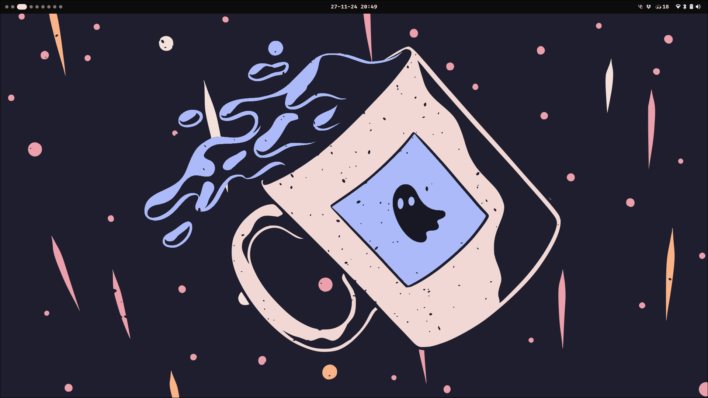

# my shell
WIP shell made with [astal](https://aylur.github.io/astal/) and [ags](https://aylur.github.io/ags/), written in typescript. Now is basically my waybar bar but written with astal. I'll be adding progressivly most of my workflow, including menus made with rofi

## features
- [x] bar
- [ ] better workspaces widget
- [ ] launcher
- [ ] taskbar
- [ ] clipboard, network, volume, brightness...


## how to use
you must need some dependencies
- ags
- astal
- hyprqtile (if you don't want it, just change [the Workspaces widget](widget/left.tsx))
- dart-sass

```bash
git clone https://github.com/daniqss/shell
cd shell
ags run .
```

## screenshots

